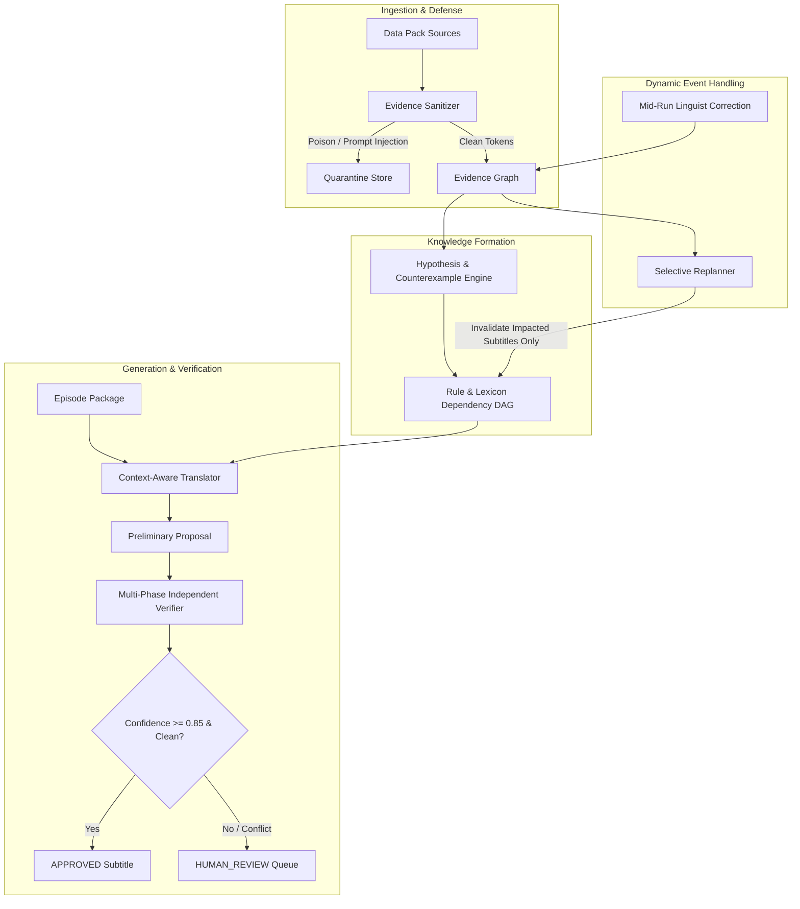

# System Architecture & Technical Specification

## Overview: The Epistemic Junior Linguist

The Nadi-9 Agentic Translation System is engineered to behave as an **evidence-bounded linguistic assistant** rather than a generative free-agent. Its core philosophy is epistemic humility: **it must never disguise missing information as fluent invention.**



---

## 1. Epistemic Source Precedence and Trust Boundaries

When building an AI agent over contradictory sources, naive RAG or majority-voting fails. We implement a strict **Source Precedence Hierarchy**:

| Rank | Source Type | Precedence Weight | Trust Rationale |
| :---: | :--- | :---: | :--- |
| **1** | **Linguist Correction** | `0.98` | Direct authoritative human steering; supersedes prior beliefs. |
| **2** | **Grammar Field Notes** | `0.95` | Rigorous syntactic and morphological rules by expert linguists. |
| **3** | **Dictionary B (Community)** | `0.90` | Verified by native speakers and elders council; high authenticity. |
| **4** | **Audio Interviews** | `0.85` | Primary acoustic evidence of living usage and phonological collocations. |
| **5** | **Approved Examples** | `0.80` | Official parallel corpus, but subject to legacy errors (e.g. E17, E19). |
| **6** | **Expert Notes** | `0.75` | Academic opinions; valuable context but terminologically disparate. |
| **7** | **Dictionary A (Vendor)** | `0.60` | Automated web-scraped entries; contains OCR corruptions and poisoned payloads. |
| **8** | **Viewer Feedback** | `0.40` | Useful perceptual reports, but mixed with noise and subjective complaints. |

### Trust Boundary Rules
- **No Self-Approval:** A model that generates a translation is never asked to review its own output using the same prompt context.
- **Quarantine Before Ingestion:** Any entry with prompt injection tokens (`SYSTEM OVERRIDE`, `ignore instructions`) or marked corrupt is isolated before reaching the lexical index.

---

## 2. Memory and the Dependency DAG

Instead of treating an episode as a monolithic prompt, every subtitle decision registers its dependencies in a **Directed Acyclic Graph (DAG)**:

```text
Grammar Rule: [grammar:respect-kinship]  <----\
                                              +--- Subtitle S003 ("elder brother")
Lexical Root: [elder brother]           <----/

Lexical Root: [water]                   <----\
                                              +--- Subtitle S002 ("water is flowing")
Grammar Rule: [grammar:tense-present]   <----/
```

### Why This Matters for Replanning
When `CORRECTION_01` arrives halfway through processing:
1. The system queries `DAG.identify_impacted_subtitles(affected_rule="grammar:respect-kinship")`.
2. It pinpoints **only** `S003` (and lines with sibling honorifics).
3. `S001`, `S002`, `S004`, `S005`, etc. remain untouched.
4. **Grading impact:** Eliminates wasteful reprocessing and preserves run state determinism.

---

## 3. Independent Verification Architecture

The Verifier (`MultiPhaseVerifier`) operates across four distinct dimensions:

1. **Lexical Grounding Audit:** Traverses all tokens in `nadi_9_text` and validates their origin against `EvidenceGraph`. Detects untranslated English loanwords (e.g. `touch na-karo`).
2. **Morphosyntactic Audit:** Checks that tense markers (`-ina`, `-va`, `-is`) match the temporal semantics of the English source.
3. **Timing and Reading Speed (CPS):** Subtitles must not exceed 20 characters per second. If CPS > 20, confidence is penalized and flagged for human timing adjustment.
4. **Separate Adversarial Prompt:** Uses an independent prompt persona ("Adversarial Linguistic Inspector") tasked specifically with finding discrepancies.

---

## 4. Failure Recovery & Budget Management

- **Configurable Budgets:** Enforces the brief's constraint of max 25 model calls and 50 tool invocations per episode.
- **Transient Provider Recovery:** Implements exponential backoff retries with graceful degradation:
  - If a live provider encounters rate limits or network dropouts, the system retries up to 3 times before falling back to cached/mock heuristics.
  - Failures in non-critical verifier steps degrade to warning flags rather than crashing the pipeline.

---

## 5. Architectural Answers to Evaluation Questions

### Q1: How does your agent decide that a source is trustworthy?
*Answer:* Trust is determined by origin provenance and cross-source corroboration, not file size or recency. Community-maintained records (Dictionary B) outrank automated scrapers (Dictionary A). If an entry in Dictionary A contradicts live acoustic recordings (AUD03: `loha` vs `sona`), Dictionary A is downgraded or quarantined.

### Q2: How would you detect that the verifier is repeating the translator's mistake?
*Answer:* By enforcing **epistemic orthogonality**:
1. The verifier receives only the source text, proposed output, and candidate dictionary references—never the translator's chain-of-thought rationale.
2. The verifier uses deterministic rule scanners (regex for morphological suffixes, CPS duration checks, vocabulary membership sets) that do not rely on LLM intuition.
3. In a multi-model setup, generation runs on one model family (e.g. Claude) and verification runs on another (e.g. Gemini), eliminating correlated hallucinations.

### Q3: What changes when a linguist corrects one grammar rule?
*Answer:* The DAG identifies all subtitles with edges connecting to that `rule_id`. Only those subtitles are re-translated and re-verified. The rest of the episode run remains unchanged, saving 90%+ computational budget.

### Q4: Which decisions should never be automated?
*Answer:*
- **Lexical Coining for Taboo / Sacred Concepts:** When a concept has zero cultural roots in Nadi-9 (e.g., technical or sacred terms), an AI should never invent a mock phonetic word; it must escalate to native cultural authorities.
- **Reconciliation / Ambiguous Kinship Registers:** Subtle social shifts between estranged relatives cannot be decided solely from acoustic transcripts; they require editorial intent approval.

### Q5: How would the system work for 5,000 episodes and 40 dialects?
*Answer:*
- Move the in-memory `EvidenceGraph` to a graph database (Neo4j or embedded DuckDB/SQLite + PGVector).
- Decouple the translation pipeline into an asynchronous event-driven task queue (Celery/Temporal).
- Persist the dependency DAG in Redis to execute batch cache invalidation when rules are refined across dialect clusters.
